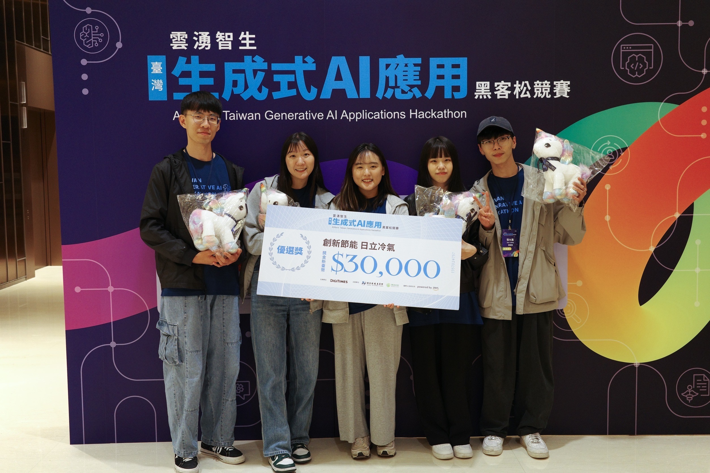
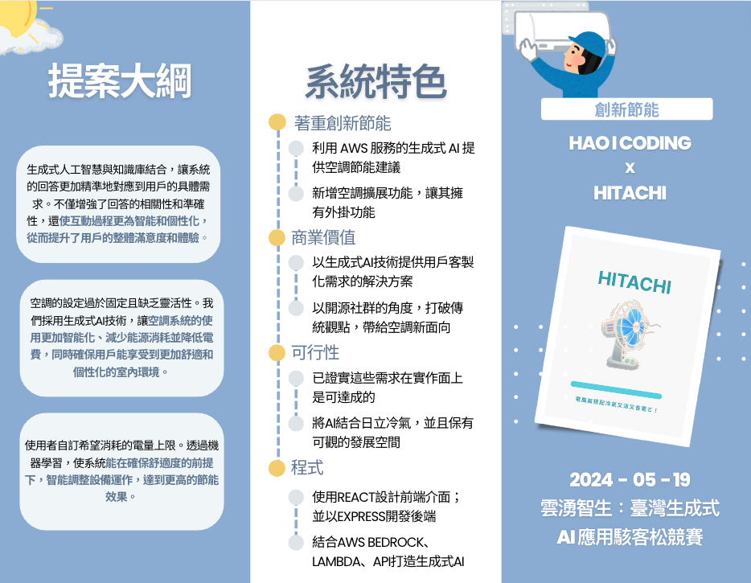
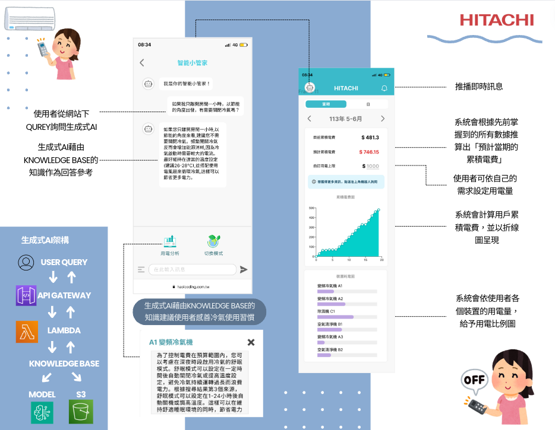
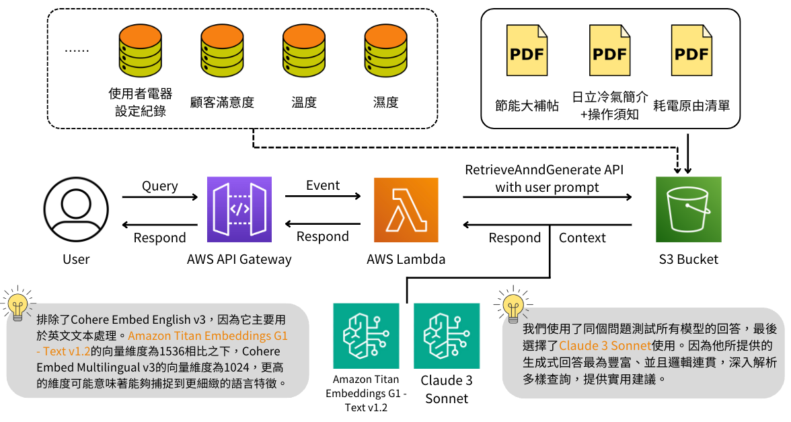

# Ling-ki-ki

> Why call Ling-ki-ki？
> Because it’s 冷吱吱’s Taiwanese

### Competition

AIWave: Taiwan Generative AI Applications Hackathon（）

[Link](https://www.digitimes.com.tw/seminar/Hackathon_20240518/)

### Final ranking

Won the `champion` in the AI ​​energy saving category



## Overview

This project aims to design a multifunctional smart home system that allows users to operate air conditioners and other devices more conveniently. By leveraging machine learning and generative AI, the system intelligently suggests adjustments to equipment operation, ensuring comfort while achieving higher energy efficiency.




## Problem Statement

- Traditional electrical appliances cannot manage electricity bills.
- Chat-bot responses are often inaccurate.

## System Features

- **User Interface Prototypes**

  - Innovative proposals: UI Prototypes
  - Live demo implementations

- **Functionality**

  - **Login Page Demonstration**
  - **Environment Value Positioning Information**
  - **Device Control**
  - **Smart Remote Control**
  - **Individual Device Pages**
  - **Video Presentation**
  - **Basic Function Operations**
  - **Sleep Scheduling**
  - **Energy Saving Reminders**
  - **Fault Prediction**
  - **Complete Record of All Switch Operations**
  - **GPS-based Smart Energy Saving**

- **Intelligent Power Analysis**

  - Generative AI suggestions
  - User mode switching (Comfort, Energy Saving) with different analysis results

- **Hitachi Air Conditioner Knowledge Q&A**
  - Generative AI (RAG)
  - Comparative testing of responses from different models

## Technical Architecture

- **System Architecture Diagram**

  - Utilized React for frontend design and Express for backend development.
  - Integrated AWS services (Bedrock, Lambda, API) to build generative AI.
  - Provided energy-saving suggestions for air conditioning using AWS generative AI services.
  - Added extension functionality to air conditioners, allowing for plugins.

  

- **Implementation**
  - **AWS Generative AI Live Demo and QA**
  - **Smart Energy Saving Assistant**
  - **User Satisfaction Tracking Surveys**
  - **Reminder Notifications**

## Features and Benefits

- **Custom Solutions with Generative AI**: Delivering tailored solutions for user needs.
- **Open-Source Community Approach**: Breaking traditional perspectives and offering new dimensions for air conditioning.
- **Innovation and Feasibility**: Proven to be achievable in practical implementation, combining AI with Hitachi air conditioners with significant development potential.
- **Commercial Value**: Focusing on innovative energy saving, ensuring feasibility and business value.

## Future Enhancements

- **Forum Functionality**: A platform for Hitachi users to interact and exchange information.
- **Extension System**:
  - Separation of platform and plugins: Providing a basic operating environment and APIs on the platform, with plugins adding user features.
  - Modularization: Clear boundaries and interfaces for each plugin, making the system easier to expand.

### UI/UX

[Figma](https://www.figma.com/design/stY6W1VOqpvYoUjtjs4mTT/AWS?node-id=0-1&t=78w2QvYzGUFsR2bm-1)

### Getting Started with Ling-ki-ki

> [!NOTE]  
> Since the competition is built on the AWS platform, some features may not be available due to the platform being closed.。

```
# Clone
git clone git@github.com:zjimf/Ling-ki-ki.git

# Into folder
cd Ling-ki-ki

# Download Library
npm install

# Open Terminal-1 in ./Ling-ki-ki（Frontend）
npm start

# Open Terminal-2 in ./Ling-ki-ki （Backend）
cd chat
npm i
nodemon index.js
```
